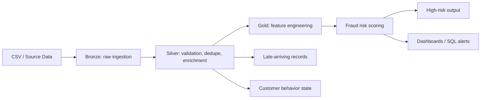

# Real-Time Credit Card Fraud Risk Scoring Pipeline

This project builds a simple Databricks pipeline for detecting risky credit-card transactions. It uses the medallion design: Bronze for raw ingest, Silver for cleaning and validation, and Gold for fraud scoring and dashboard output.

This folder is ready for review and local checks, but the actual Databricks run still needs a real cluster and workspace. The code is written to be honest about that.

Business problem
----------------
Banks and payment platforms need to spot suspicious transactions quickly. Large payments, sudden location changes, high transaction speed, odd hours, and unusual merchant patterns can all be signs of fraud. This project shows one practical way to process those transactions in a pipeline and score risk.

Objective
---------
The project aims to:
- ingest raw transaction data into Bronze
- clean and validate the data in Silver
- build fraud features and score risk in Gold
- create dashboard-friendly outputs and alert-ready records
- support streaming and incremental processing in a realistic Databricks setup

Architecture
------------



Medallion architecture
----------------------
- Bronze: raw, append-only ledger of transaction files with ingestion metadata and source file tracking
- Silver: valid transaction data, data quality flags, rejected records, standardization, duplicates, and profile enrichment
- Gold: transaction-level features, customer and card behavior, scoring, and high-risk outputs

Bronze
------
- Reads raw transaction CSV files from a configurable input path
- Adds ingestion metadata such as `ingest_timestamp`, `source_file`, and `raw_record_hash`
- Uses PySpark Structured Streaming with Delta as the sink
- Writes into `fraud_db.bronze_transactions`

Silver
------
- Validates required fields and business rules
- Parses timestamps and amounts, rejects invalid records into a separate table
- Standardizes categories and locations
- Joins to `customer_profile.csv`
- Tracks data quality indicators and pass/fail status
- Stores valid records in `fraud_db.silver_transactions`
- Stores invalid rows in `fraud_db.silver_rejected_transactions`

Gold
----
- Builds persistent historical features such as rolling counts, amount deviations, merchant frequency, and previous-transaction lookup
- Maintains customer/card behavior state in Delta tables across micro-batches
- Computes a transparent risk score from explainable rules
- Produces a rule-based transaction output table and a high-risk alert table

Fraud scoring
-------------
The scoring model is deterministic and explainable:
- high amount indicator
- velocity indicator
- location hop indicator
- unusual hour indicator
- amount deviation in customer history
- merchant frequency anomaly

The score is clamped to 0-100 and mapped as:
- 0-30: LOW
- 31-70: MEDIUM
- 71-100: HIGH

Streaming
---------
The project uses PySpark Structured Streaming with Delta checkpoints and `foreachBatch` processing to support incremental updates. For a sample-data setup without Kafka, a realistic streaming simulation is created by reading the directory of incoming CSVs with Auto Loader. This is near-real-time micro-batch processing, not a false claim of production Kafka streaming.

Late-arriving data
------------------
Late-arriving transactions are handled with `withWatermark` and explicit routing to a late-arrivals table when they fall outside the acceptable lateness window. This avoids corrupting historical windows without silently dropping data.

Incremental processing
----------------------
Incremental processing is supported through Delta Change Data Feed (CDF) helpers and checkpoints. CDF is optional for this project and is used only where it provides value. It is not required for a static sample dataset, so the project keeps implementation realistic and focused.

Data quality
------------
The pipeline explicitly tracks:
- mandatory field checks
- duplicate detection
- invalid amounts
- malformed timestamps
- invalid categorical values
- rejected record counts
- quality indicator columns

Dashboard
---------
The project includes SQL views for:
- total transactions
- total transaction amount
- fraud transactions
- fraud percentage
- risk distribution
- trend over time
- risky merchants and locations
- high-risk transaction views

Technology stack
----------------
- Databricks
- Apache Spark / PySpark
- Delta Lake
- Structured Streaming
- Auto Loader
- SQL / Delta tables
- Python + pytest for validation

Dataset description
-------------------
The repo includes:
- `data/transaction.csv`: transaction stream sample
- `data/customer_profile.csv`: customer baseline profile data with average spend and preferred category

Folder structure
----------------
```text
Real-Time-Credit-Card-Fraud-Risk-Scoring-Pipeline/
├── README.md
├── requirements.txt
├── .gitignore
├── data/
│   ├── transaction.csv
│   └── customer_profile.csv
├── docs/
│   ├── architecture.md
│   └── fraud_rules.md
├── notebooks/
│   ├── 01_bronze_ingestion.py
│   ├── 02_silver_transformation.py
│   ├── 03_gold_fraud_scoring.py
│   ├── 04_late_arriving_data.py
│   ├── 05_incremental_processing.py
│   └── 06_dashboard_views.sql
├── sql/
│   ├── create_database.sql
│   ├── gold_views.sql
│   └── validation_queries.sql
├── src/
│   ├── __init__.py
│   ├── config.py
│   └── fraud_rules.py
├── tests/
│   └── test_fraud_rules.py
└── .
```

Databricks setup
----------------
1. Create or attach to a Databricks cluster with Spark and Delta enabled.
2. Upload the CSV files to a workspace-accessible path such as `dbfs:/FileStore/rtcc_transactions`.
3. Create the database and placeholder tables using `sql/create_database.sql`.
4. Run notebooks in this order:
   1. `notebooks/01_bronze_ingestion.py`
   2. `notebooks/02_silver_transformation.py`
   3. `notebooks/04_late_arriving_data.py`
   4. `notebooks/03_gold_fraud_scoring.py`
   5. `notebooks/05_incremental_processing.py` (optional helper notebook)
   6. `notebooks/06_dashboard_views.sql`
5. Validate with `sql/validation_queries.sql`.

Exact execution order
---------------------
1. `sql/create_database.sql`
2. `notebooks/01_bronze_ingestion.py`
3. `notebooks/02_silver_transformation.py`
4. `notebooks/04_late_arriving_data.py`
5. `notebooks/03_gold_fraud_scoring.py`
6. `notebooks/05_incremental_processing.py` (optional)
7. `notebooks/06_dashboard_views.sql`

Expected outputs
----------------
- `fraud_db.bronze_transactions`
- `fraud_db.silver_transactions`
- `fraud_db.silver_rejected_transactions`
- `fraud_db.silver_late_arrivals`
- `fraud_db.gold_transaction_features`
- `fraud_db.gold_customer_behavior_state`
- `fraud_db.gold_high_risk_transactions`
- Dashboard views in `fraud_db`

Testing
-------
Static validation is included in the repository via `pytest` tests for:
- risk score calculation
- boundary rules
- risk level mapping
- invalid amount handling
- duplicate handling
- category and location normalization

These tests are local and do not require Databricks. Databricks execution still needs to be validated in the target workspace.

Limitations
-----------
- The repository is designed for Databricks execution and cannot claim to have run there from this environment.
- Streaming datasets, checkpoint behavior, and cloud paths need actual workspace validation.
- Real-time fraud detection in production would normally include larger datasets, ML models, or more advanced anomaly detection.

Future improvements
-------------------
- Add Kafka or Event Hubs integration
- Use feature store and model monitoring
- Add user-defined alerts and threshold tuning
- Add backfill and replay support
- Add notebook parameterization and secret management using Databricks Secrets or Unity Catalog

Interview explanation
--------------------
This project shows a solid understanding of the medallion architecture, streaming ingestion, delta tables, validation, stateful feature engineering, explainable rule-based scoring, and dashboard reporting. The design emphasizes auditability, idempotency, and repeatable pipelines rather than a single monolithic script.

Static verification completed locally
------------------------------------
- Python syntax checks and tests were run locally where possible.
- Databricks execution and workspace-specific table creation still require running the notebooks inside the target Databricks workspace.
