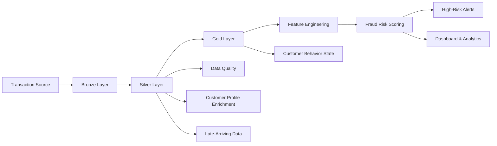

# Real-Time Credit Card Fraud Risk Scoring Pipeline

A real-time credit card fraud risk scoring pipeline built using **Databricks, PySpark, Delta Lake, Structured Streaming, Auto Loader, and the Medallion Architecture**.

The pipeline processes transaction data through **Bronze, Silver, and Gold layers**, performs data quality checks and enrichment, generates explainable fraud-risk scores, and produces dashboard-ready outputs for identifying high-risk transactions.

---

## Business Problem

Banks and payment platforms need to identify suspicious credit-card transactions quickly and reliably.

Fraudulent transactions may be associated with:

* Unusually high transaction amounts
* Rapid transaction velocity
* Sudden location changes
* Transactions during unusual hours
* Unusual customer spending behavior
* Abnormal merchant activity

This project demonstrates a scalable data engineering approach for processing transaction data and generating transparent fraud-risk scores.

---

## Project Objectives

The pipeline is designed to:

* Ingest transaction data into a Bronze layer
* Clean, validate, and enrich data in the Silver layer
* Build transaction and customer behavior features
* Apply explainable fraud detection rules
* Generate risk scores from 0–100
* Classify transactions into LOW, MEDIUM, and HIGH risk
* Identify high-risk transactions for alerting
* Support near-real-time streaming processing
* Handle late-arriving transactions
* Support incremental processing using Delta Lake
* Provide dashboard-ready analytical outputs

---

## Architecture



---

## Medallion Architecture

### Bronze Layer

The Bronze layer stores raw transaction data with ingestion metadata.

Responsibilities:

* Raw transaction ingestion
* Append-oriented storage
* Source file tracking
* Ingestion timestamps
* Record hashing
* Structured Streaming ingestion
* Delta Lake storage

Main table:

```text
fraud_db.bronze_transactions
```

---

### Silver Layer

The Silver layer cleans, validates, standardizes, and enriches the Bronze data.

Responsibilities:

* Required-field validation
* Timestamp parsing
* Amount validation
* Duplicate detection
* Category normalization
* Location normalization
* Data quality indicators
* Customer profile enrichment
* Invalid record separation

Main tables:

```text
fraud_db.silver_transactions
fraud_db.silver_rejected_transactions
```

---

### Gold Layer

The Gold layer creates analytical features and fraud-risk outputs.

Responsibilities:

* Transaction-level feature engineering
* Customer behavior analysis
* Card behavior state
* Historical transaction features
* Rolling transaction counts
* Amount deviation analysis
* Merchant frequency analysis
* Fraud-risk scoring
* High-risk transaction identification

Main tables:

```text
fraud_db.gold_transaction_features
fraud_db.gold_customer_behavior_state
fraud_db.gold_high_risk_transactions
```

---

# Fraud Detection & Risk Scoring

The project uses a deterministic and explainable rule-based scoring approach.

The scoring engine considers:

1. **High Amount Indicator**
2. **Transaction Velocity Indicator**
3. **Location Hop Indicator**
4. **Unusual Hour Indicator**
5. **Customer Amount Deviation**
6. **Merchant Frequency Anomaly**

The final risk score is constrained between **0 and 100**.

### Risk Classification

| Risk Score | Risk Level |
| ---------- | ---------- |
| 0–30       | LOW        |
| 31–70      | MEDIUM     |
| 71–100     | HIGH       |

The approach is intentionally explainable so that each high-risk transaction can be associated with specific fraud indicators.

---

# Streaming Processing

The pipeline uses **PySpark Structured Streaming** with Delta Lake checkpoints and `foreachBatch` processing.

For the sample-data environment, transaction files are processed using **Databricks Auto Loader** to simulate continuous incoming data.

The implementation supports:

* Incremental file ingestion
* Micro-batch processing
* Checkpointing
* Delta Lake sinks
* Stateful processing
* Incremental feature updates

This provides a realistic near-real-time streaming architecture without falsely claiming a production Kafka deployment.

---

# Late-Arriving Data

The pipeline includes dedicated handling for late-arriving transactions.

The implementation uses:

* Structured Streaming watermarks
* Acceptable lateness windows
* Explicit late-record routing
* Delta Lake storage for late-arriving records

Late transactions can be stored separately in:

```text
fraud_db.silver_late_arrivals
```

This approach helps preserve historical processing consistency while maintaining visibility into delayed data.

---

# Incremental Processing

The project includes support for incremental processing using **Delta Change Data Feed (CDF)** and streaming checkpoints.

Incremental processing helps avoid unnecessarily processing the entire dataset for every update.

The project also keeps CDF optional so that the pipeline remains practical for a sample-data environment.

---

# Data Quality

Data quality checks are applied during the Silver transformation stage.

The pipeline checks for:

* Missing mandatory fields
* Invalid transaction amounts
* Malformed timestamps
* Duplicate transactions
* Invalid categories
* Invalid locations
* Rejected records
* Data quality indicators

Invalid records are separated from valid transaction records for auditability.

---

# Customer Enrichment

Transaction data is enriched using customer profile information.

The customer profile dataset provides baseline information such as:

* Average spending behavior
* Preferred transaction category
* Customer-level attributes

This enrichment enables the Gold layer to compare current transactions against historical customer behavior.

---

# Dashboard & Analytics

The project includes SQL views designed for fraud monitoring and dashboard visualization.

Dashboard-ready metrics include:

* Total transactions
* Total transaction amount
* Fraud/high-risk transactions
* Fraud percentage
* Risk-level distribution
* Fraud trends over time
* High-risk merchants
* High-risk locations
* Recent high-risk transactions
* Transaction risk scores

The dashboard outputs are generated from optimized Gold-layer data and SQL views.

---

# Technology Stack

| Technology           | Purpose                                  |
| -------------------- | ---------------------------------------- |
| Databricks           | Data engineering and processing platform |
| Apache Spark         | Distributed data processing              |
| PySpark              | Data transformation and streaming        |
| Delta Lake           | Reliable transactional data storage      |
| Structured Streaming | Near-real-time processing                |
| Auto Loader          | Incremental file ingestion               |
| SQL                  | Analytics and dashboard views            |
| Python               | Pipeline logic and testing               |
| Pytest               | Unit testing and validation              |

---

# Dataset

The repository contains sample datasets for demonstrating the pipeline.

### Transaction Dataset

```text
data/transaction.csv
```

Contains sample credit-card transaction records used as the streaming input.

### Customer Profile Dataset

```text
data/customer_profile.csv
```

Contains customer baseline information used for transaction enrichment and behavioral comparison.

---

# Project Structure

```text
Real-Time-Credit-Card-Fraud-Risk-Scoring-Pipeline/
│
├── README.md
├── requirements.txt
├── .gitignore
│
├── data/
│   ├── transaction.csv
│   └── customer_profile.csv
│
├── docs/
│   ├── architecture.md
│   └── fraud_rules.md
│
├── notebooks/
│   ├── 01_bronze_ingestion.py
│   ├── 02_silver_transformation.py
│   ├── 03_gold_fraud_scoring.py
│   ├── 04_late_arriving_data.py
│   ├── 05_incremental_processing.py
│   └── 06_dashboard_views.sql
│
├── sql/
│   ├── create_database.sql
│   ├── gold_views.sql
│   └── validation_queries.sql
│
├── src/
│   ├── __init__.py
│   ├── config.py
│   └── fraud_rules.py
│
└── tests/
    └── test_fraud_rules.py
```

---

# Databricks Execution

## Prerequisites

The pipeline is designed to run in a Databricks workspace with:

* Apache Spark
* Delta Lake
* PySpark
* Structured Streaming
* Auto Loader

---

## Execution Order

Run the components in the following order:

### 1. Create Database

```text
sql/create_database.sql
```

### 2. Bronze Ingestion

```text
notebooks/01_bronze_ingestion.py
```

### 3. Silver Transformation

```text
notebooks/02_silver_transformation.py
```

### 4. Late-Arriving Data Handling

```text
notebooks/04_late_arriving_data.py
```

### 5. Gold Fraud Scoring

```text
notebooks/03_gold_fraud_scoring.py
```

### 6. Incremental Processing

```text
notebooks/05_incremental_processing.py
```

This component can be used when incremental/CDF processing is required.

### 7. Dashboard Views

```text
notebooks/06_dashboard_views.sql
```

### 8. Validation Queries

```text
sql/validation_queries.sql
```

---

# Expected Outputs

The pipeline produces the following main Delta tables:

```text
fraud_db.bronze_transactions

fraud_db.silver_transactions

fraud_db.silver_rejected_transactions

fraud_db.silver_late_arrivals

fraud_db.gold_transaction_features

fraud_db.gold_customer_behavior_state

fraud_db.gold_high_risk_transactions
```

Dashboard and analytical views are created in:

```text
fraud_db
```

---

# Testing

The repository includes automated Python tests using `pytest`.

The tests cover:

* Risk score calculation
* Risk score boundaries
* Risk-level mapping
* Invalid transaction amounts
* Duplicate handling
* Category normalization
* Location normalization
* Fraud-rule behavior

Run the tests locally using:

```bash
python -m pytest -q
```

---

# Data Engineering Concepts Demonstrated

This project demonstrates practical understanding of:

* Medallion Architecture
* ETL / ELT pipelines
* Batch and streaming processing
* Apache Spark
* PySpark
* Delta Lake
* Structured Streaming
* Auto Loader
* Data validation
* Data quality
* Data enrichment
* Feature engineering
* Stateful processing
* Incremental processing
* Change Data Feed
* Late-arriving data
* SQL analytics
* Dashboard data preparation
* Explainable fraud detection
* Unit testing

---

# Production Considerations

A production-grade fraud detection system could further integrate:

* Kafka or Azure Event Hubs
* Machine learning models
* Feature Store
* Model monitoring
* Real-time alerting systems
* Databricks Unity Catalog
* Databricks Secrets
* Advanced data governance
* CI/CD pipelines
* Cloud monitoring and observability

---

# Future Improvements

Potential future enhancements include:

* Kafka/Event Hubs integration for live transaction events
* Machine-learning-based fraud prediction
* Feature Store integration
* Model monitoring
* Configurable fraud thresholds
* Real-time notification systems
* Backfill and replay mechanisms
* Notebook parameterization
* Unity Catalog governance
* Databricks Secrets for secure configuration
* Automated CI/CD deployment

---

# Interview Explanation

This project demonstrates a complete data engineering pipeline for real-time credit-card fraud risk scoring.

The architecture follows the **Medallion pattern**, where raw transaction data is first ingested into the Bronze layer, cleaned and enriched in the Silver layer, and then transformed into analytical features and fraud-risk outputs in the Gold layer.

**PySpark Structured Streaming and Auto Loader** are used for incremental ingestion, while **Delta Lake** provides reliable storage and supports incremental processing.

The fraud engine uses explainable rules based on transaction amount, velocity, location changes, unusual transaction times, customer spending deviations, and merchant behavior.

The final Gold-layer outputs are used to identify high-risk transactions and provide dashboard-ready analytics.

The design focuses on:

* Scalability
* Explainability
* Data quality
* Auditability
* Incremental processing
* Reliable Delta-based storage
* Reusable data engineering components

---

# Project Outcome

The completed pipeline provides an end-to-end demonstration of how transaction data can be transformed from raw input into actionable fraud-risk information.

The project combines **Databricks, PySpark, Delta Lake, Structured Streaming, Auto Loader, SQL, data quality validation, feature engineering, and dashboard analytics** into a single data engineering solution.
